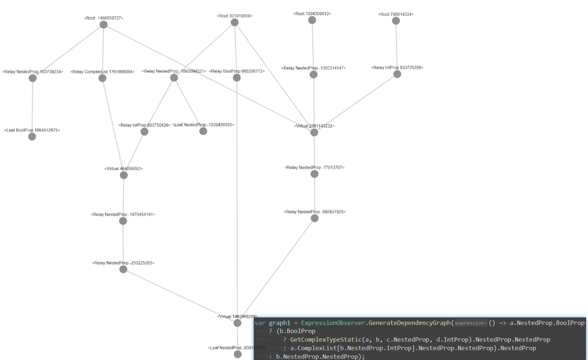
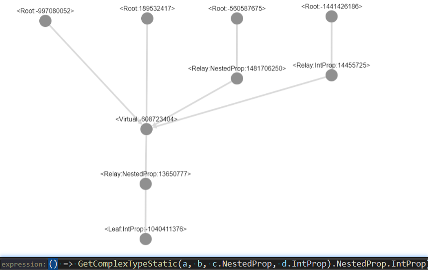
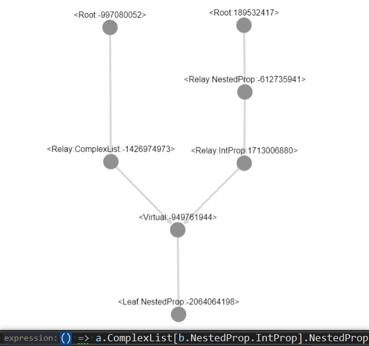
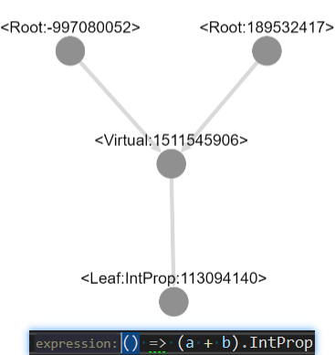
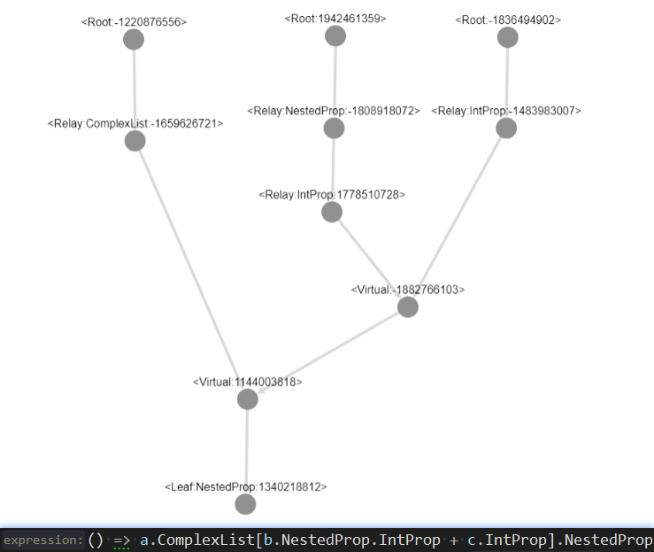

# DataBinding

## What is it

Automatically subscribe and unsubscribe all of the `INotifyPropertyChanged` objects in the expression you provided. It can analyze conditional expressions and raise the `PropertyChanged` event when appropriate.

## How to use

- Common

```csharp
// ExpressionObserver.Observes<T>(Expression<Func<T>, Action<T, Exception>): void
ExpressionObserver.Observes(
    () => a.BoolProp ? a.NestedProp.StringProp : a.StringProp,
    (value, exception) =>
    {
        // On value changed
    });
```

- "Computed Property" (like vue.js)

```csharp
public class ViewModel : BindableBaseEx
{
    public double RectangularArea => GetProperty(() => Width * Height);
}
```

## How it works

Any expression will be parsed into a dependency graph and a conditional expression tree.

- Dependency Graph: Each dependency node corresponds to an property or closure field in the expression you provoded. When an `INPC` property changed, its corresponding dependency node will unsubscribe from the old `INPC` object and subscribe to the new `INPC` object, and notify its downstream nodes to unsubscribe and subscribe.
- Conditional Expression Tree: Control the activation state of dependency nodes, and an inactivated dependency node will not observe the property changed event. Maybe it can improve performance.

## Some Dependency Graph Examples







## License

[Anti-996 License-1.0](LICENSE)
